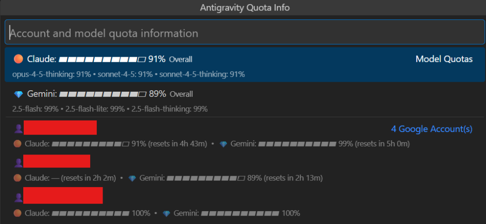
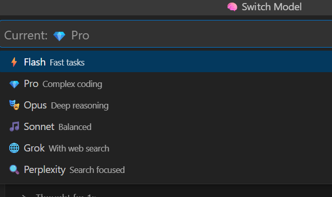
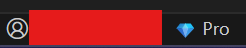

# Antigravity Proxy Status

VS Code extension for Antigravity Claude Proxy - real-time quota monitoring, multi-account management, and instant model switching.



## ✨ Key Features

### 🪟 Per-Window Model Selection (v4.0.0)
- **Independent models per window** - Each VS Code/Antigravity window maintains its own model
- **Workspace persistence** - Your model choice persists for each project/workspace
- **No more conflicts** - Multiple windows can use different models simultaneously

### 📊 Real-Time Quota Monitoring
- **Click to view quotas** - Click the account icon to see Claude & Gemini quota status
- **Per-model breakdown** - See individual quotas for Opus, Sonnet, Flash, Pro
- **Reset time display** - Know exactly when your quota resets
- **Smart account sorting** - Accounts with highest Claude quota shown first (helps when manually switching Antigravity accounts)

### 🧠 Instant Model Switching
- **One-click switching** - Click model name in status bar to switch models
- **Supported models**: Flash ⚡, Pro 💎, Opus 🎭, Sonnet 🎵, Grok 🌐, Perplexity 🔍
- **Per-window sync** - Model changes are saved per-window, not globally



### 👤 Status Bar Integration
- **Account icon** - Shows proxy connection status
- **Model display** - Current model with emoji indicator (per-window)
- **Offline detection** - Shows "Offline" in red when proxy is down



## Status Bar Layout

| Icon | Description | Click Action |
|------|-------------|--------------|
| 👤 | Account/Quota | Opens quota popup with all accounts |
| 💎 Pro | Current model (per-window) | Opens model switcher |

## Per-Window Model Selection

**New in v4.0.0:** Each window now maintains its own model independently.

| Scenario | Behavior |
|----------|----------|
| Window A sets Flash | Window A uses Flash |
| Window B sets Pro | Window B uses Pro, Window A still uses Flash |
| Reopen Window A | Window A still uses Flash (persisted) |

This is perfect for:
- Using **Flash** for quick tasks in one project
- Using **Opus** for complex reasoning in another project
- No more model "ping-pong" between windows!

## Quota Popup Features

When you click the account icon:

1. **Model Quotas** - Overall Claude and Gemini percentages with visual bars
2. **Google Accounts** - All connected accounts sorted by Claude availability
3. **Reset Times** - Shows when each account's quota resets
4. **Open Dashboard** - Quick link to full proxy dashboard

## Commands

| Command | Description |
|---------|-------------|
| `Antigravity: Switch Model` | Choose a different AI model (saved per-window) |
| `Antigravity: Open Dashboard` | Open proxy dashboard in browser |

## Requirements

- Antigravity Proxy running on `localhost:8080`
- VS Code / Antigravity 1.80.0+

## Installation

### From Open VSX (Recommended)
Search "Antigravity Proxy Status" in extensions marketplace.

### From VSIX
```powershell
antigravity --install-extension claude-proxy-status-4.0.0.vsix
```

## Advanced Features

- **Per-window models** - Each window/workspace has its own model selection
- **Auto-account rotation** - Proxy automatically switches to next account when quota exhausted
- **Multi-account support** - Connect unlimited Google accounts via dashboard
- **Visual quota bars** - Color-coded (filled/empty blocks) for quick status reading
- **Instant polling** - 5-second refresh for real-time quota updates

## Changelog

### v4.0.0
- **Per-window model selection** - Each window maintains its own model independently
- Models persist per-workspace across restarts
- Fixed model "ping-pong" issue when multiple windows were open

### v3.9.x
- Quota popup improvements
- Account sorting by Claude availability
- UI refinements

## License

MIT

